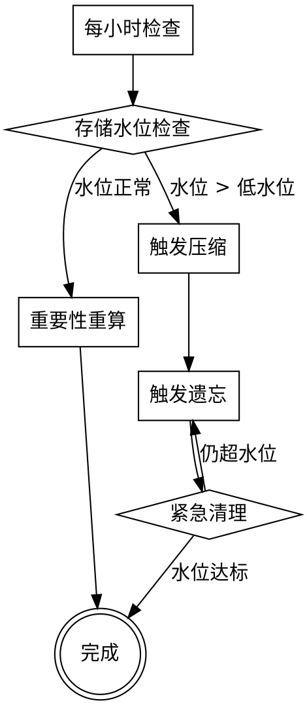

# MemRec - 算法与策略详细设计文档

## 1. 重要性评分算法

### 1.1 理论依据

重要性评分借鉴了信息检索中的 **TF-IDF** 思想和人类记忆心理学中的 **遗忘曲线** 理论：

- **艾宾浩斯遗忘曲线**: 记忆强度随时间衰减，呈指数下降
- **访问频率**: 高频访问的记忆应保留更高权重（类比TF-IDF中的TF）
- **语义相关性**: 特定标签（如"决策"、"关键"）应赋予更高权重
- **用户主观重要性**: 用户显式标记的优先级应尊重

### 1.2 数学模型

**综合重要性评分公式:**

```
I(memory) = w_r * R(memory) + w_f * F(memory) + w_s * S(memory) + w_e * E(memory)

其中:
- I: 综合重要性评分 [0.0, 1.0]
- R: 时间衰减因子
- F: 访问频率因子
- S: 语义重要性因子
- E: 用户显式优先级
- w_r, w_f, w_s, w_e: 各因子权重，默认 0.3, 0.2, 0.2, 0.3
```

### 1.3 各因子计算

#### 1.3.1 时间衰减因子 R

**指数衰减模型:**

```
R(memory) = e^(-λ * Δt)

其中:
- Δt: 自上次访问以来的天数
- λ: 衰减系数，默认 0.05（约30天后重要性衰减至约22%）
```

**衰减曲线可视化:**

```
天数  |  0   7   14   30   60   90   180
R值   | 1.0 0.70 0.49 0.22 0.05 0.01 0.0001
```

**可配置参数:**

```rust
struct DecayConfig {
    lambda: f32,         // 衰减系数，默认 0.05
    half_life_days: f32, // 半衰期，默认 ln(2)/0.05 ≈ 14天
}
```

#### 1.3.2 访问频率因子 F

**对数增长模型（防止高频访问过度膨胀）:**

```
F(memory) = ln(access_count + 1) / normalize_factor

其中:
- access_count: 访问次数
- normalize_factor: 归一化因子，默认 10.0（100次访问达到 0.46）
```

**归一化选择原因:**
- 对数增长避免了线性增长导致的"超级记忆"问题
- 第1次访问: F = 0.0
- 第10次访问: F = 0.24
- 第100次访问: F = 0.46
- 第1000次访问: F = 0.69

#### 1.3.3 语义重要性因子 S

**基于标签权重的计算:**

```rust
fn semantic_importance(tags: &[String], tag_weights: &HashMap<String, f32>) -> f32 {
    if tags.is_empty() {
        return 0.5;  // 无标签时默认中等重要性
    }
    
    // 取所有标签的最大权重
    tags.iter()
        .map(|tag| tag_weights.get(tag).copied().unwrap_or(0.5))
        .max()
        .unwrap_or(0.5)
}

// 默认标签权重
static DEFAULT_TAG_WEIGHTS: HashMap<String, f32> = {
    let mut m = HashMap::new();
    m.insert("critical", 1.0);
    m.insert("decision", 0.9);
    m.insert("key", 0.8);
    m.insert("important", 0.7);
    m.insert("config", 0.6);
    m.insert("reference", 0.5);
    m.insert("note", 0.4);
    m.insert("temporary", 0.2);
    m.insert("draft", 0.1);
    m
};
```

#### 1.3.4 用户显式优先级 E

**从 metadata 提取:**

```rust
fn explicit_priority(memory: &Memory) -> f32 {
    memory.metadata.get("priority")
        .and_then(|p| p.parse::<f32>().ok())
        .unwrap_or(0.5)
}

// 用户可通过以下方式设置优先级:
// 1. CLI命令: memrec tag <id> --priority 0.9
// 2. Metadata字段: {"priority": "0.9"}
// 3. 标签隐式: critical=1.0, important=0.7
```

### 1.4 完整实现

```rust
pub struct ImportanceCalculator {
    config: ImportanceConfig,
    tag_weights: HashMap<String, f32>,
}

pub struct ImportanceConfig {
    lambda: f32,              // 时间衰减系数，默认 0.05
    frequency_normalize: f32, // 频率归一化因子，默认 10.0
    weight_recency: f32,      // 时间衰减权重，默认 0.3
    weight_frequency: f32,    // 访问频率权重，默认 0.2
    weight_semantic: f32,     // 语义重要性权重，默认 0.2
    weight_explicit: f32,     // 显式优先级权重，默认 0.3
}

impl ImportanceCalculator {
    pub fn calculate(&self, memory: &Memory) -> f32 {
        let now = Utc::now();
        
        // 1. 时间衰减因子
        let days_since_access = (now - memory.last_accessed).num_days() as f32;
        let recency = (-self.config.lambda * days_since_access).exp();
        
        // 2. 访问频率因子
        let frequency = (memory.access_count as f32 + 1.0).ln() / self.config.frequency_normalize;
        
        // 3. 语义重要性因子
        let semantic = self.semantic_importance(&memory.tags);
        
        // 4. 用户显式优先级
        let explicit = memory.metadata.get("priority")
            .and_then(|p| p.parse::<f32>().ok())
            .unwrap_or(0.5);
        
        // 5. 加权融合
        let importance = self.config.weight_recency * recency
            + self.config.weight_frequency * frequency
            + self.config.weight_semantic * semantic
            + self.config.weight_explicit * explicit;
        
        // 6. 归一化到 [0.0, 1.0]
        importance.clamp(0.0, 1.0)
    }
    
    fn semantic_importance(&self, tags: &[String]) -> f32 {
        if tags.is_empty() {
            return 0.5;
        }
        
        tags.iter()
            .map(|tag| self.tag_weights.get(tag).copied().unwrap_or(0.5))
            .max()
            .unwrap_or(0.5)
    }
}
```

### 1.5 测试用例

```rust
#[cfg(test)]
mod tests {
    use super::*;
    
    #[test]
    fn test_new_memory_high_importance() {
        let memory = Memory {
            last_accessed: Utc::now(),
            access_count: 0,
            tags: vec!["decision"],
            metadata: HashMap::new(),
            ..Memory::default()
        };
        
        let calc = ImportanceCalculator::default();
        let importance = calc.calculate(&memory);
        
        // 新记忆、决策标签，预期重要性 > 0.7
        assert!(importance > 0.7);
    }
    
    #[test]
    fn test_old_memory_low_importance() {
        let memory = Memory {
            last_accessed: Utc::now() - Duration::days(90),
            access_count: 1,
            tags: vec!["note"],
            metadata: HashMap::new(),
            ..Memory::default()
        };
        
        let calc = ImportanceCalculator::default();
        let importance = calc.calculate(&memory);
        
        // 90天未访问、低频、低优先级标签，预期重要性 < 0.2
        assert!(importance < 0.2);
    }
    
    #[test]
    fn test_critical_tag_max_importance() {
        let memory = Memory {
            last_accessed: Utc::now(),
            access_count: 5,
            tags: vec!["critical"],
            metadata: HashMap::new(),
            ..Memory::default()
        };
        
        let calc = ImportanceCalculator::default();
        let importance = calc.calculate(&memory);
        
        // critical标签权重1.0，预期重要性接近1.0
        assert!(importance > 0.9);
    }
}
```

---

## 2. 压缩策略

### 2.1 设计目标

- **保留关键信息**: 决策、结论、重要引用必须保留
- **减少冗余**: 相似内容合并去重
- **可追溯性**: 压缩后的记忆能追溯到原始记忆
- **体积控制**: 压缩后体积应减少 50%-80%

### 2.2 压缩类型

| 类型 | 输入 | 输出 | 算法 |
|------|------|------|------|
| 对话压缩 | 多轮对话序列 | 摘要 + 关键决策点 | LLM摘要 + 规则提取 |
| 知识压缩 | 相似知识节点集 | 合并的知识节点 | 向量聚类 + 内容融合 |
| 时间窗口压缩 | 时间段内所有记忆 | 时间窗口摘要 | 分组聚合 + LLM摘要 |

### 2.3 对话压缩算法

**触发条件:**
- 重要性 < 0.3
- 对话类型记忆
- 距创建时间 > 7天

**算法流程:**

```
输入: conversation_memories (对话记忆序列)

1. 关键信息提取
   a. 识别决策点: 包含"决定"、"选择"、"采用"等关键词的消息
   b. 识别结论: 包含"结论"、"因此"、"最终"等关键词的消息
   c. 识别重要引用: 代码片段、配置内容、重要链接

2. 生成摘要
   a. 使用LLM对完整对话生成摘要（100-200字）
   b. 摘要应包含: 问题背景、讨论要点、最终结论

3. 创建压缩记忆节点
   a. memory_type = CompressedConversation
   b. content = 摘要文本
   c. metadata = {
       "original_ids": [原始记忆ID列表],
       "key_decisions": [决策点列表],
       "key_conclusions": [结论列表],
       "compression_ratio": 压缩比例,
       "compression_date": 压缩日期
   }

4. 保留追溯链
   a. 压缩记忆的 embedding 指向摘要向量
   b. metadata中保留原始记忆ID，可展开查看

输出: compressed_memory
```

**实现代码:**

```rust
pub struct ConversationCompressor {
    llm_client: LLMClient,
    key_phrase_patterns: Vec<String>,
}

impl ConversationCompressor {
    pub fn compress(&self, memories: Vec<Memory>) -> Result<Memory> {
        // 1. 提取关键信息
        let key_decisions = self.extract_decisions(&memories);
        let key_conclusions = self.extract_conclusions(&memories);
        let key_references = self.extract_references(&memories);
        
        // 2. 生成摘要
        let full_content = memories.iter()
            .map(|m| m.content.as_str())
            .collect::<Vec<_>>()
            .join("\n---\n");
        
        let summary = self.llm_client.summarize(&full_content)?;
        
        // 3. 创建压缩记忆
        let compressed = Memory {
            id: Uuid::new_v4(),
            memory_type: MemoryType::CompressedConversation,
            content: summary,
            summary: None,
            embedding: None,  // 后续异步生成
            importance: self.calculate_compressed_importance(&memories),
            created_at: Utc::now(),
            last_accessed: Utc::now(),
            access_count: 0,
            tags: self.merge_tags(&memories),
            metadata: {
                let mut m = HashMap::new();
                m.insert("original_ids".to_string(), serde_json::to_string(&memories.iter().map(|m| m.id).collect::<Vec<_>>())?);
                m.insert("key_decisions".to_string(), serde_json::to_string(&key_decisions)?);
                m.insert("key_conclusions".to_string(), serde_json::to_string(&key_conclusions)?);
                m.insert("key_references".to_string(), serde_json::to_string(&key_references)?);
                m.insert("compression_ratio".to_string(), self.calculate_ratio(&memories, &summary));
                m.insert("compression_date".to_string(), Utc::now().to_rfc3339());
                m
            },
            project_id: memories[0].project_id,
            is_deleted: false,
            deleted_at: None,
        };
        
        Ok(compressed)
    }
    
    fn extract_decisions(&self, memories: &[Memory]) -> Vec<String> {
        let decision_patterns = [
            "决定", "选择", "采用", "最终方案", "确定",
            "decided", "chosen", "selected", "final", "determined"
        ];
        
        memories.iter()
            .filter(|m| decision_patterns.iter().any(|p| m.content.contains(p)))
            .map(|m| m.content.clone())
            .collect()
    }
    
    fn extract_conclusions(&self, memories: &[Memory]) -> Vec<String> {
        let conclusion_patterns = [
            "结论", "因此", "最终", "总结", "综上",
            "conclusion", "therefore", "finally", "summary", "in summary"
        ];
        
        memories.iter()
            .filter(|m| conclusion_patterns.iter().any(|p| m.content.contains(p)))
            .map(|m| m.content.clone())
            .collect()
    }
    
    fn calculate_compressed_importance(&self, memories: &[Memory]) -> f32 {
        // 压缩记忆的重要性 = 原始记忆重要性的加权平均
        let total_weight = memories.len() as f32;
        let weighted_sum = memories.iter()
            .map(|m| m.importance)
            .sum::<f32>();
        
        (weighted_sum / total_weight).clamp(0.3, 0.7)  // 压缩记忆重要性限制在中等范围
    }
}
```

### 2.4 知识压缩算法

**触发条件:**
- 重要性 < 0.5
- 知识类型记忆
- 存在高度相似的知识节点

**算法流程:**

```
输入: knowledge_memories (知识记忆集合)

1. 向量聚类
   a. 提取所有知识的embedding向量
   b. 使用聚类算法（如DBSCAN或K-Means）
   c. 识别相似度 > 0.85 的知识节点群

2. 合并策略
   a. 对于每个相似群，选择最完整的版本作为主版本
   b. 合并其他版本的内容到主版本
   c. 合并标签（去重）
   d. 合并metadata（保留所有引用）

3. 创建合并记忆
   a. memory_type = Knowledge
   b. content = 合并后的完整内容
   c. metadata = {
       "merged_ids": [被合并的记忆ID],
       "merge_date": 合并日期,
       "similarities": [原始相似度列表]
   }

4. 清理原记忆
   a. 被合并的原记忆标记为软删除
   b. metadata中记录"merged_into": 新记忆ID

输出: merged_memories
```

**实现代码:**

```rust
pub struct KnowledgeCompressor {
    similarity_threshold: f32,  // 默认 0.85
}

impl KnowledgeCompressor {
    pub fn find_similar_clusters(&self, memories: &[Memory]) -> Vec<Vec<Memory>> {
        // 1. 构建向量矩阵
        let embeddings: Vec<Vec<f32>> = memories.iter()
            .filter_map(|m| m.embedding.clone())
            .collect();
        
        // 2. 计算相似度矩阵
        let similarities = self.compute_similarity_matrix(&embeddings);
        
        // 3. 聚类（简单贪心算法）
        let mut clusters: Vec<Vec<usize>> = Vec::new();
        let mut visited = vec![false; memories.len()];
        
        for i in 0..memories.len() {
            if visited[i] {
                continue;
            }
            
            let mut cluster = vec![i];
            visited[i] = true;
            
            for j in (i+1)..memories.len() {
                if !visited[j] && similarities[i][j] > self.similarity_threshold {
                    cluster.push(j);
                    visited[j] = true;
                }
            }
            
            if cluster.len() > 1 {
                clusters.push(cluster);
            }
        }
        
        // 4. 转换为记忆集合
        clusters.iter()
            .map(|cluster| cluster.iter().map(|i| memories[*i].clone()).collect())
            .collect()
    }
    
    pub fn merge_cluster(&self, memories: Vec<Memory>) -> Result<Memory> {
        // 选择内容最长的作为主版本
        let main = memories.iter()
            .max_by(|a, b| a.content.len().cmp(&b.content.len()))
            .unwrap();
        
        // 合并标签
        let merged_tags = memories.iter()
            .flat_map(|m| m.tags.clone())
            .collect::<HashSet<_>>()
            .into_iter()
            .collect();
        
        // 合并metadata
        let merged_metadata = {
            let mut m = main.metadata.clone();
            m.insert("merged_ids".to_string(), 
                serde_json::to_string(&memories.iter().map(|m| m.id).collect::<Vec<_>>())?);
            m.insert("merge_date".to_string(), Utc::now().to_rfc3339());
            m
        };
        
        Ok(Memory {
            id: Uuid::new_v4(),
            memory_type: MemoryType::Knowledge,
            content: main.content.clone(),
            summary: None,
            embedding: main.embedding.clone(),
            importance: memories.iter().map(|m| m.importance).max().unwrap_or(0.5),
            created_at: memories.iter().map(|m| m.created_at).min().unwrap(),
            last_accessed: Utc::now(),
            access_count: memories.iter().map(|m| m.access_count).sum(),
            tags: merged_tags,
            metadata: merged_metadata,
            project_id: main.project_id,
            is_deleted: false,
            deleted_at: None,
        })
    }
    
    fn compute_similarity_matrix(&self, embeddings: &[Vec<f32>]) -> Vec<Vec<f32>> {
        let n = embeddings.len();
        let mut matrix = vec![vec![0.0; n]; n];
        
        for i in 0..n {
            for j in i..n {
                let sim = cosine_similarity(&embeddings[i], &embeddings[j]);
                matrix[i][j] = sim;
                matrix[j][i] = sim;
            }
        }
        
        matrix
    }
}

fn cosine_similarity(a: &[f32], b: &[f32]) -> f32 {
    let dot = a.iter().zip(b.iter()).map(|(x, y)| x * y).sum::<f32>();
    let norm_a = (a.iter().map(|x| x * x).sum::<f32>()).sqrt();
    let norm_b = (b.iter().map(|x| x * x).sum::<f32>()).sqrt();
    
    if norm_a == 0.0 || norm_b == 0.0 {
        0.0
    } else {
        dot / (norm_a * norm_b)
    }
}
```

### 2.5 压缩时机与调度

```rust
pub struct CompressionScheduler {
    config: CompressionConfig,
    compressor: Arc<dyn Compressor>,
}

pub struct CompressionConfig {
    trigger_importance: f32,     // 默认 0.3
    trigger_age_days: u32,       // 默认 7
    batch_size: usize,           // 默认 100
    schedule_interval_hours: u32, // 默认 1
}

impl CompressionScheduler {
    pub async fn run_cycle(&self) -> Result<()> {
        // 1. 查询需要压缩的记忆
        let candidates = self.find_compression_candidates()?;
        
        if candidates.is_empty() {
            return Ok(());
        }
        
        // 2. 分批压缩
        for batch in candidates.chunks(self.config.batch_size) {
            let compressed = self.compressor.compress(batch.to_vec())?;
            
            // 3. 存储压缩记忆
            self.storage.save(&compressed)?;
            
            // 4. 软删除原记忆
            for original in batch {
                self.storage.soft_delete(original.id)?;
            }
            
            // 5. 更新索引
            self.index.update_compressed(&compressed, batch)?;
        }
        
        Ok(())
    }
    
    fn find_compression_candidates(&self) -> Result<Vec<Memory>> {
        let now = Utc::now();
        let age_threshold = now - Duration::days(self.config.trigger_age_days as i64);
        
        // 查询条件:
        // - importance < trigger_importance
        // - created_at < age_threshold
        // - memory_type in [Conversation, Knowledge]
        // - is_deleted = false
        // - 未被压缩过（metadata中没有"compressed_into"）
        
        self.storage.query(CompressionQuery {
            max_importance: self.config.trigger_importance,
            created_before: age_threshold,
            types: vec![MemoryType::Conversation, MemoryType::Knowledge],
            exclude_deleted: true,
            exclude_compressed: true,
        })
    }
}
```

---

## 3. 遗忘策略

### 3.1 遗忘阶段

```
记忆生命周期:
┌─────────┐   ┌──────────┐   ┌──────────┐   ┌──────────┐   ┌──────────┐
│ 新记忆   │ → │ 活跃期   │ → │ 衰减期   │ → │ 归档期   │ → │ 遗忘期   │
│ importance │ │ importance │ │ importance │ │ 被压缩   │ │ 被删除   │
│  0.8-1.0  │ │  0.6-0.8  │ │  0.3-0.6  │ │  保留摘要 │ │  移除    │
│ access=0  │ │  access++ │ │  access低 │ │  可追溯   │ │  audit   │
└─────────┘   └──────────┘   └──────────┘   └──────────┘   └──────────┘
```

### 3.2 软删除策略

**触发条件:**
- 用户显式删除命令
- 重要性 < compression_importance 且 已被压缩
- 系统自动清理（低优先级）

**软删除实现:**

```rust
pub struct SoftDeleter {
    config: SoftDeleteConfig,
}

pub struct SoftDeleteConfig {
    recovery_days: u32,  // 默认 30
}

impl SoftDeleter {
    pub fn soft_delete(&self, memory: &mut Memory) -> Result<()> {
        memory.is_deleted = true;
        memory.deleted_at = Some(Utc::now());
        
        // 从活跃索引移除，但保留主存储
        self.index.remove_from_active(memory.id)?;
        
        // 添加到删除索引（便于恢复）
        self.index.add_to_deleted(memory)?;
        
        Ok(())
    }
    
    pub fn recover(&self, memory: &mut Memory) -> Result<()> {
        if !memory.is_deleted {
            return Err(anyhow!("Memory is not deleted"));
        }
        
        // 检查是否在恢复期内
        let deleted_duration = Utc::now() - memory.deleted_at.unwrap();
        if deleted_duration.num_days() > self.config.recovery_days as i64 {
            return Err(anyhow!("Memory is beyond recovery period"));
        }
        
        memory.is_deleted = false;
        memory.deleted_at = None;
        
        // 重新添加到活跃索引
        self.index.add_to_active(memory)?;
        
        Ok(())
    }
}
```

### 3.3 硬删除策略

**触发条件（满足任一）:**

| 条件 | 公式 | 说明 |
|------|------|------|
| 低重要性长期未访问 | `importance < 0.1 AND last_accessed > 90天` | 最宽松条件 |
| 软删除超期 | `is_deleted AND deleted_at + 30天 < now` | 超过恢复期 |
| 存储压力紧急 | `storage_usage > 0.95 AND importance < 0.3` | 紧急清理 |

**硬删除实现:**

```rust
pub struct HardDeleter {
    config: HardDeleteConfig,
    audit_logger: AuditLogger,
}

pub struct HardDeleteConfig {
    importance_threshold: f32,   // 默认 0.1
    inactive_days_threshold: u32, // 默认 90
    emergency_threshold: f32,    // 默认 0.95
    emergency_importance: f32,   // 默认 0.3
}

impl HardDeleter {
    pub fn find_candidates(&self) -> Result<Vec<Memory>> {
        let now = Utc::now();
        
        // 条件1: 低重要性 + 长期未访问
        let low_importance = self.storage.query(HardDeleteQuery {
            max_importance: self.config.importance_threshold,
            last_accessed_before: now - Duration::days(self.config.inactive_days_threshold as i64),
        });
        
        // 条件2: 软删除超期
        let expired_soft_delete = self.storage.query(SoftDeleteExpiredQuery {
            deleted_before: now - Duration::days(30),
        });
        
        // 合并候选列表
        let candidates = [low_importance, expired_soft_delete]
            .into_iter()
            .flatten()
            .collect::<Vec<_>>();
        
        Ok(candidates)
    }
    
    pub fn hard_delete(&self, memory: &Memory) -> Result<()> {
        // 1. 记录审计日志（保留元信息）
        self.audit_logger.log(DeletionAudit {
            memory_id: memory.id,
            memory_type: memory.memory_type,
            importance: memory.importance,
            created_at: memory.created_at,
            deleted_at: Utc::now(),
            reason: self.determine_reason(memory),
            content_hash: self.hash_content(&memory.content),
        })?;
        
        // 2. 从RocksDB移除所有数据
        self.storage.remove(memory.id)?;
        
        // 3. 从usearch移除向量
        self.vector_store.remove(memory.id)?;
        
        // 4. 从所有索引移除
        self.index.remove_all(memory.id)?;
        
        Ok(())
    }
    
    fn determine_reason(&self, memory: &Memory) -> DeletionReason {
        if memory.is_deleted {
            DeletionReason::ExpiredSoftDelete
        } else if memory.importance < self.config.importance_threshold {
            DeletionReason::LowImportance
        } else {
            DeletionReason::StoragePressure
        }
    }
}

pub struct DeletionAudit {
    memory_id: Uuid,
    memory_type: MemoryType,
    importance: f32,
    created_at: DateTime<Utc>,
    deleted_at: DateTime<Utc>,
    reason: DeletionReason,
    content_hash: String,  // SHA256 of content
}

pub enum DeletionReason {
    LowImportance,
    ExpiredSoftDelete,
    StoragePressure,
    UserExplicit,
}
```

### 3.4 紧急清理策略

**触发条件:**
- 存储使用率 > 95%（超过高水位线）

**清理优先级:**

```
优先级队列（从高到低）:
1. 重要性 < 0.1 的记忆
2. 重要性 < 0.2 的记忆
3. 软删除 > 15天的记忆
4. 重要性 < 0.3 的记忆
5. 被压缩的原始记忆
```

**实现:**

```rust
impl EmergencyCleaner {
    pub async fn emergency_cleanup(&self, target_usage: f32) -> Result<()> {
        let current_usage = self.storage.get_usage_ratio();
        
        if current_usage < self.config.emergency_threshold {
            return Ok(());
        }
        
        // 分阶段清理，直到达到目标使用率
        while current_usage > target_usage {
            let batch = self.select_cleanup_batch()?;
            
            for memory in batch {
                self.hard_delete(&memory)?;
            }
            
            current_usage = self.storage.get_usage_ratio();
            
            // 避免一次清理太多
            if batch.is_empty() {
                break;
            }
        }
        
        Ok(())
    }
    
    fn select_cleanup_batch(&self) -> Result<Vec<Memory>> {
        // 按优先级顺序查询，每批50个
        let priorities = [
            (0.1, 50),  // importance < 0.1
            (0.2, 50),  // importance < 0.2
            (0.3, 50),  // importance < 0.3
        ];
        
        for (threshold, limit) in priorities {
            let batch = self.storage.query(Query {
                max_importance: threshold,
                limit,
                order_by: OrderBy::ImportanceAsc,
            })?;
            
            if !batch.is_empty() {
                return Ok(batch);
            }
        }
        
        Ok(Vec::new())
    }
}
```

---

## 4. 混合检索算法

### 4.1 算法选择依据

**RRF (Reciprocal Rank Fusion) 优势:**
- 不需要调参，常量k通常固定为60
- 对排名敏感，而非对分数敏感
- 适合融合不同评分体系的检索结果

**替代方案对比:**

| 方案 | 优点 | 缺点 |
|------|------|------|
| RRF | 无需调参、鲁棒性强 | 忽略原始分数 |
| 加权平均 | 保留分数信息 | 需调参、评分体系差异大 |
| 学习排序 | 精度最高 | 需训练数据、计算成本高 |

### 4.2 RRF算法详解

**公式:**

```
RRF_score(d) = Σ (1 / (k + rank_i(d)))

其中:
- d: 文档（记忆）
- rank_i(d): 文档d在第i个检索结果中的排名
- k: 常量，默认60
```

**示例计算:**

```
精确检索结果: [M1, M3, M5, M7] (排名1-4)
语义检索结果: [M2, M3, M1, M6, M5] (排名1-5)

RRF分数计算:
- M1: 1/(60+1) * 0.6 + 1/(60+3) * 0.4 = 0.0164 + 0.0063 = 0.0227
- M3: 1/(60+2) * 0.6 + 1/(60+1) * 0.4 = 0.0145 + 0.0066 = 0.0211
- M2: 0 * 0.6 + 1/(60+1) * 0.4 = 0 + 0.0066 = 0.0066

最终排序: [M1, M3, M2, ...]
```

### 4.3 完整实现

```rust
pub struct HybridSearcher {
    exact_searcher: ExactSearcher,
    semantic_searcher: SemanticSearcher,
    rrf_config: RRFConfig,
}

pub struct RRFConfig {
    k: f32,              // 默认 60.0
    weight_exact: f32,   // 默认 0.6
    weight_semantic: f32, // 默认 0.4
}

impl HybridSearcher {
    pub fn search(&self, query: &SearchQuery) -> Result<SearchResult> {
        let start = Instant::now();
        
        // 1. 并行执行两种检索
        let (exact_results, semantic_results) = tokio::try_join!(
            self.exact_search(query),
            self.semantic_search(query),
        )?;
        
        // 2. RRF融合
        let merged = self.rrf_merge(exact_results, semantic_results);
        
        // 3. 应用额外过滤（时间范围、重要性等）
        let filtered = self.apply_filters(merged, query);
        
        // 4. 截断到top_k
        let final_results = filtered.into_iter()
            .take(query.top_k)
            .collect();
        
        Ok(SearchResult {
            memories: final_results,
            total: final_results.len(),
            mode: SearchMode::Hybrid,
            elapsed_ms: start.elapsed().as_millis() as u64,
        })
    }
    
    fn rrf_merge(
        &self,
        exact: Vec<Memory>,
        semantic: Vec<Memory>,
    ) -> Vec<Memory> {
        // 计算RRF分数
        let mut scores: HashMap<Uuid, f32> = HashMap::new();
        
        // 精确结果打分
        for (rank, memory) in exact.iter().enumerate() {
            let rrf_score = 1.0 / (self.rrf_config.k + rank as f32 + 1.0);
            *scores.entry(memory.id).or_insert(0.0) += rrf_score * self.rrf_config.weight_exact;
        }
        
        // 语义结果打分
        for (rank, memory) in semantic.iter().enumerate() {
            let rrf_score = 1.0 / (self.rrf_config.k + rank as f32 + 1.0);
            *scores.entry(memory.id).or_insert(0.0) += rrf_score * self.rrf_config.weight_semantic;
        }
        
        // 按分数排序并获取记忆
        let memory_map: HashMap<Uuid, Memory> = exact.iter()
            .chain(semantic.iter())
            .map(|m| (m.id, m.clone()))
            .collect();
        
        let mut results: Vec<Memory> = scores.keys()
            .filter_map(|id| memory_map.get(id).cloned())
            .collect();
        
        results.sort_by(|a, b| {
            scores[&b.id].partial_cmp(&scores[&a.id]).unwrap()
        });
        
        results
    }
    
    fn apply_filters(&self, memories: Vec<Memory>, query: &SearchQuery) -> Vec<Memory> {
        memories.into_iter()
            .filter(|m| {
                // 重要性过滤
                if m.importance < query.min_importance {
                    return false;
                }
                
                // 时间范围过滤
                if let Some((start, end)) = &query.time_range {
                    if m.created_at < *start || m.created_at > *end {
                        return false;
                    }
                }
                
                // 项目过滤
                if let Some(project_id) = query.project_id {
                    if m.project_id != Some(project_id) {
                        return false;
                    }
                }
                
                // 删除状态过滤
                if !query.include_deleted && m.is_deleted {
                    return false;
                }
                
                true
            })
            .collect()
    }
}
```

### 4.4 检索优化策略

```rust
pub struct SearchOptimizer {
    cache: SearchCache,
    prefetch: Prefetcher,
}

impl SearchOptimizer {
    // 1. 查询缓存
    fn cache_search(&self, query: &SearchQuery) -> Option<SearchResult> {
        let cache_key = self.hash_query(query);
        self.cache.get(&cache_key)
    }
    
    // 2. 向量预计算
    fn prefetch_embedding(&self, text: &str) -> Option<Vec<f32>> {
        // 对高频查询文本预计算embedding
        self.prefetch.get_embedding(text)
    }
    
    // 3. 结果预热
    fn warmup(&self, popular_queries: &[SearchQuery]) {
        for query in popular_queries {
            // 预执行检索，填充缓存
            self.hybrid_searcher.search(query).ok();
        }
    }
}

pub struct SearchCache {
    cache: LruCache<String, SearchResult>,
    ttl: Duration,  // 默认 5分钟
}

impl SearchCache {
    fn get(&self, key: &str) -> Option<SearchResult> {
        self.cache.get(key)
            .filter(|result| result.created_at + self.ttl > Utc::now())
            .cloned()
    }
}
```

---

## 5. 向量嵌入策略

### 5.1 嵌入模型选择

| 模型 | 维度 | 成本 | 优点 | 缺点 |
|------|------|------|------|------|
| OpenAI text-embedding-3-small | 1536 | API调用 | 质量高、速度快 | 需联网、有成本 |
| OpenAI text-embedding-3-large | 3072 | API调用 | 质量最高 | 成本高、体积大 |
| sentence-transformers (本地) | 768 | 免费 | 离线可用 | 需本地GPU/算力 |

**推荐方案:**
- 第一期: OpenAI API（便于快速开发）
- 第二期: 本地模型（降低成本、提高隐私）

### 5.2 文本预处理

```rust
pub struct TextPreprocessor {
    max_length: usize,    // 默认 8000 字符（OpenAI限制）
    min_length: usize,    // 默认 10 字符
}

impl TextPreprocessor {
    pub fn preprocess(&self, content: &str) -> String {
        // 1. 清理无效字符
        let cleaned = content
            .replace('\x00', "")
            .trim()
            .to_string();
        
        // 2. 截断超长文本
        let truncated = if cleaned.len() > self.max_length {
            // 保留前8000字符 + "...[截断]"
            format!("{}...[截断]", &cleaned[..self.max_length])
        } else {
            cleaned
        };
        
        // 3. 跳过过短文本
        if truncated.len() < self.min_length {
            return "".to_string();  // 不生成embedding
        }
        
        truncated
    }
}
```

### 5.3 嵌入缓存策略

**缓存设计:**

```rust
pub struct EmbeddingCache {
    storage: RocksDBCF,  // Column Family: "embedding_cache"
    max_entries: usize,  // 默认 10000
    ttl_days: u32,       // 默认 30
}

impl EmbeddingCache {
    pub fn get_or_compute(&self, text: &str, compute_fn: impl FnOnce() -> Result<Vec<f32>>) -> Result<Vec<f32>> {
        // 1. 计算文本哈希
        let hash = self.hash_text(text);
        
        // 2. 查询缓存
        if let Some(embedding) = self.storage.get(&hash)? {
            return Ok(embedding);
        }
        
        // 3. 调用计算函数
        let embedding = compute_fn()?;
        
        // 4. 存入缓存
        self.storage.put(&hash, &embedding)?;
        
        Ok(embedding)
    }
    
    fn hash_text(&self, text: &str) -> String {
        // SHA256哈希
        let mut hasher = Sha256::new();
        hasher.update(text.as_bytes());
        format!("{:x}", hasher.finalize())
    }
}
```

### 5.4 异步嵌入生成

```rust
pub struct AsyncEmbeddingGenerator {
    queue: VecDeque<EmbeddingTask>,
    worker: EmbeddingWorker,
    batch_size: usize,  // 默认 100
}

impl AsyncEmbeddingGenerator {
    pub fn enqueue(&self, memory: &Memory) {
        if memory.embedding.is_some() {
            return;  // 已有embedding，跳过
        }
        
        self.queue.push_back(EmbeddingTask {
            memory_id: memory.id,
            content: memory.content.clone(),
            status: EmbeddingStatus::Pending,
        });
    }
    
    pub async fn process_batch(&self) -> Result<()> {
        // 批量处理（减少API调用次数）
        let batch = self.queue.drain(..self.batch_size).collect::<Vec<_>>();
        
        if batch.is_empty() {
            return Ok(());
        }
        
        // 调用批量嵌入API
        let texts = batch.iter().map(|t| t.content.clone()).collect::<Vec<_>>();
        let embeddings = self.worker.batch_embed(&texts)?;
        
        // 更新记忆
        for (task, embedding) in batch.iter().zip(embeddings.iter()) {
            self.storage.update_embedding(task.memory_id, embedding)?;
        }
        
        Ok(())
    }
}
```

---

## 6. 自动管理流程

### 6.1 管理周期调度

```rust
pub struct MemoryManager {
    scheduler: Scheduler,
    importance_calculator: ImportanceCalculator,
    compressor: Compressor,
    deleter: Deleter,
    config: ManagementConfig,
}

pub struct ManagementConfig {
    check_interval_hours: u32,     // 默认 1
    importance_recalc_interval: u32, // 默认 24
    compression_interval: u32,     // 默认 6
    cleanup_interval: u32,         // 默认 12
}

impl MemoryManager {
    pub fn start(&self) {
        // 注册定时任务
        self.scheduler.register("importance_recalc", 
            Duration::hours(self.config.importance_recalc_interval as i64),
            self.recalculate_importance_task());
        
        self.scheduler.register("compression",
            Duration::hours(self.config.compression_interval as i64),
            self.compression_task());
        
        self.scheduler.register("cleanup",
            Duration::hours(self.config.cleanup_interval as i64),
            self.cleanup_task());
        
        self.scheduler.start();
    }
    
    fn recalculate_importance_task(&self) -> Task {
        Task::new(|| async {
            // 重新计算所有活跃记忆的重要性
            let memories = self.storage.get_all_active()?;
            
            for memory in memories {
                let new_importance = self.importance_calculator.calculate(&memory);
                self.storage.update_importance(memory.id, new_importance)?;
            }
            
            Ok(())
        })
    }
    
    fn compression_task(&self) -> Task {
        Task::new(|| async {
            // 检查存储水位
            let usage = self.storage.get_usage_ratio();
            
            if usage > self.config.low_watermark {
                // 触发压缩
                self.compressor.compress_low_importance()?;
            }
            
            Ok(())
        })
    }
    
    fn cleanup_task(&self) -> Task {
        Task::new(|| async {
            // 1. 清理过期软删除
            self.deleter.cleanup_expired_soft_delete()?;
            
            // 2. 清理低重要性记忆
            self.deleter.cleanup_low_importance()?;
            
            // 3. 检查紧急清理
            let usage = self.storage.get_usage_ratio();
            if usage > self.config.high_watermark {
                self.deleter.emergency_cleanup(self.config.low_watermark)?;
            }
            
            Ok(())
        })
    }
}
```

### 6.2 管理流程图



### 6.3 监控与告警

```rust
pub struct MemoryMonitor {
    metrics: MetricsCollector,
    alerter: Alerter,
}

impl MemoryMonitor {
    pub fn collect_metrics(&self) -> MemoryMetrics {
        MemoryMetrics {
            total_memories: self.storage.count_memories(),
            active_memories: self.storage.count_active(),
            deleted_memories: self.storage.count_deleted(),
            storage_usage: self.storage.get_usage_ratio(),
            avg_importance: self.storage.avg_importance(),
            embedding_pending: self.embedding_queue.len(),
        }
    }
    
    pub fn check_alerts(&self, metrics: &MemoryMetrics) {
        // 高水位告警
        if metrics.storage_usage > 0.85 {
            self.alerter.alert(Alert {
                level: AlertLevel::Warning,
                message: format!("存储使用率达到 {:.1}%，建议手动清理", metrics.storage_usage * 100),
            });
        }
        
        // 紧急告警
        if metrics.storage_usage > 0.95 {
            self.alerter.alert(Alert {
                level: AlertLevel::Critical,
                message: format!("存储使用率达到 {:.1}%，已触发紧急清理", metrics.storage_usage * 100),
            });
        }
        
        // 嵌入队列告警
        if metrics.embedding_pending > 500 {
            self.alerter.alert(Alert {
                level: AlertLevel::Warning,
                message: format!("嵌入队列积压 {} 个任务", metrics.embedding_pending),
            });
        }
    }
}
```

---

## 7. 参数配置汇总

### 7.1 重要性评分参数

| 参数 | 默认值 | 说明 |
|------|--------|------|
| lambda | 0.05 | 时间衰减系数 |
| frequency_normalize | 10.0 | 频率归一化因子 |
| weight_recency | 0.3 | 时间衰减权重 |
| weight_frequency | 0.2 | 访问频率权重 |
| weight_semantic | 0.2 | 语义重要性权重 |
| weight_explicit | 0.3 | 显式优先级权重 |

### 7.2 压缩参数

| 参数 | 默认值 | 说明 |
|------|--------|------|
| trigger_importance | 0.3 | 压缩触发重要性阈值 |
| trigger_age_days | 7 | 压缩触发最小年龄 |
| similarity_threshold | 0.85 | 知识压缩相似度阈值 |
| batch_size | 100 | 批量压缩大小 |
| compression_interval_hours | 6 | 压缩检查间隔 |

### 7.3 遗忘参数

| 参数 | 默认值 | 说明 |
|------|--------|------|
| soft_delete_recovery_days | 30 | 软删除恢复期 |
| hard_delete_importance | 0.1 | 硬删除重要性阈值 |
| hard_delete_inactive_days | 90 | 硬删除未访问天数 |
| emergency_threshold | 0.95 | 紧急清理触发水位 |

### 7.4 存储参数

| 参数 | 默认值 | 说明 |
|------|--------|------|
| max_storage_gb | 10 | 最大存储容量 |
| high_watermark | 0.9 | 高水位线 |
| low_watermark | 0.7 | 低水位线 |

### 7.5 检索参数

| 参数 | 默认值 | 说明 |
|------|--------|------|
| rrf_k | 60.0 | RRF常量 |
| rrf_weight_exact | 0.6 | 精确检索权重 |
| rrf_weight_semantic | 0.4 | 语义检索权重 |
| default_top_k | 10 | 默认返回数量 |
| cache_ttl_minutes | 5 | 查询缓存有效期 |

---

## 8. 附录

### 8.1 数学公式汇总

**重要性评分:**
```
I = 0.3 * e^(-0.05*Δt) + 0.2 * ln(n+1)/10 + 0.2 * S + 0.3 * E
```

**RRF融合:**
```
RRF(d) = 0.6 * Σ(1/(60+rank_exact(d))) + 0.4 * Σ(1/(60+rank_semantic(d)))
```

**余弦相似度:**
```
cos(a, b) = (a·b) / (||a|| * ||b||)
```

### 8.2 参考文献

- **艾宾浩斯遗忘曲线**: Ebbinghaus, H. (1885). Memory: A Contribution to Experimental Psychology
- **RRF算法**: Cormack, G. V., et al. (2009). Reciprocal Rank Fusion outperforms Condorcet and individual Rank Learning Methods
- **HNSW向量索引**: Malkov, Y. A., & Yashunin, D. A. (2020). Efficient and robust approximate nearest neighbor search using Hierarchical Navigable Small World graphs